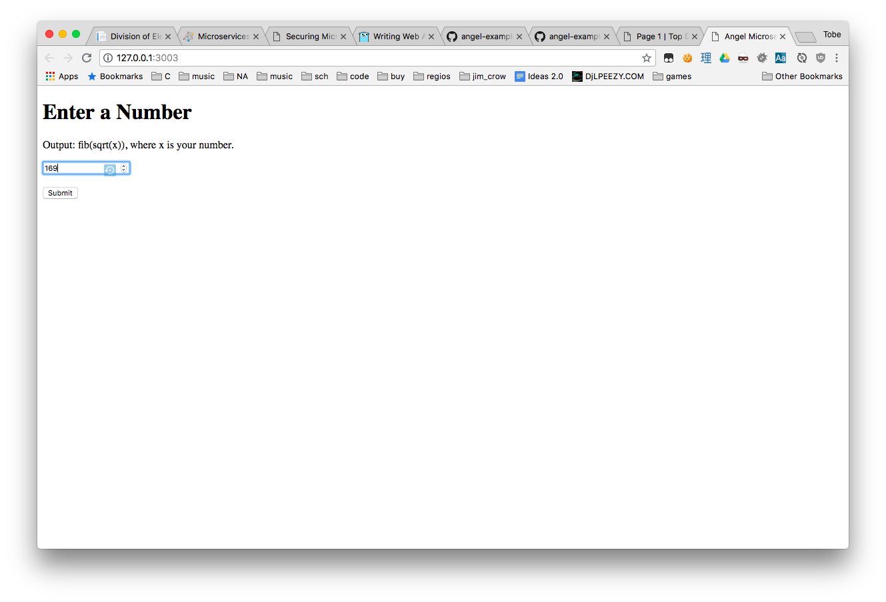

# microservices

Using Angel to build microservices, with JWT authentication.

## Running

To start the servers, run `dart tool/daemon.dart`, and then
visit `http://localhost:3003`.

In a production environment, prefer using something like
`systemd` to spawn your microservices, independently of one
another, so that they can be updated independently as well.

## About

This is an **overly-complicated** API that can be used to compute
square roots, as well as Fibonacci numbers.

It consists no less than **6 separate components**:

- `my_api` - Common Dart code
- `my_api_auth` - The central server; it has three functions:
  - Authentication via client ID and secret
  - Verification of JWT's and permissions (via scopes)
  - Discovery of other microservices
- `my_api_client` - Shared code that wraps `package:angel_client` and queries the authentication service.
- `fibonacci_microservice` - Computes the `nth` Fibonacci number for an integer `n`.
- `sqrt_microservice` - Computes the square root of a number `n`.
- `frontend_microservice` - Serves a static HTML page, as well as providing
an `/api/compute` API that invokes the `authentication`, `fibonacci`, *and* `sqrt`
microsrvices in order to compute the Fibonacci number at the `ith` index, where
`i` is the square root of `n`, a user-provided number.

Ultimately, it is unnecessarily complex for a simple mathematical operation,
but it illustrates the microservice concept very well.

## Authentication

Authentication in this project, as mentioned above, goes through
one server; this server is powered by `package:angel_auth`. Though it
would have also been possible to combine this with `package:angel_oauth2`
to run an in-house OAuth2 provided, because the only clients calling the
API are _first-party_ microservices, I deemed it overkill in this situation.

If you will eventually have third parties accesing your API, consider using
OAuth2 to delegate access on behalf of users.

## Authorization
The JWT's issued by the authentication server do not contain information about the
scopes a client is permitted to access; furthermore, the necessary secret to
validate JWT's is only known to the authentication server.

Because of this, individual microservices have no way to ensure a client is
truly allowed to perform an action. The verification is performed by sending
a call to the authentication service, in true microservice fashion.

Though this may increase latency due to having to send data across the network,
it guarantees separation of concerns, and allows each microservice to only
focus on its own specific task(s).